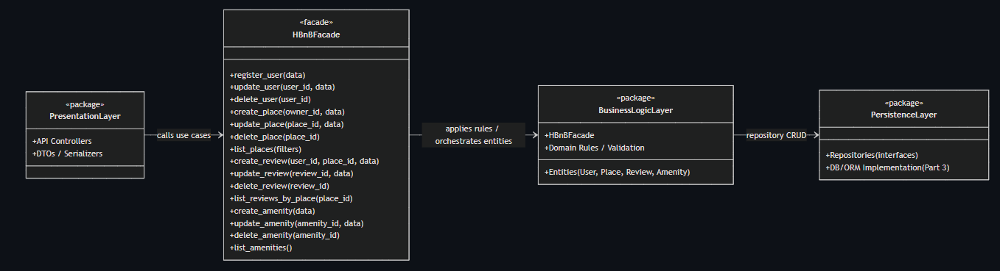
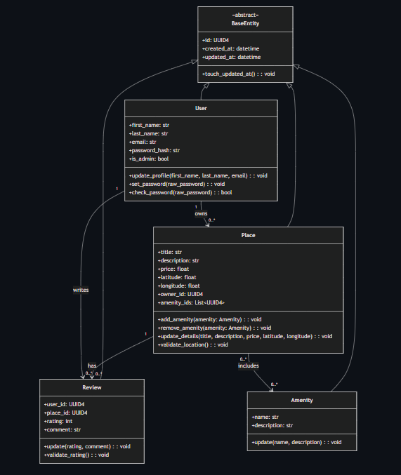
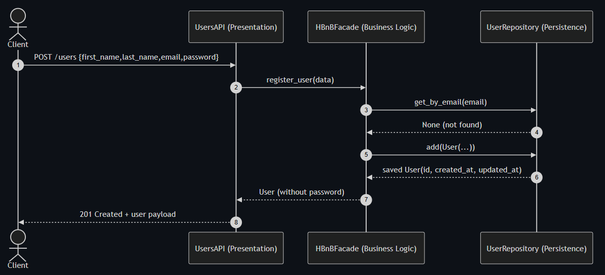
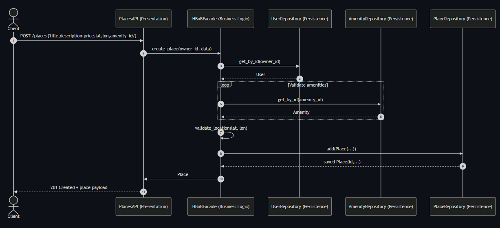
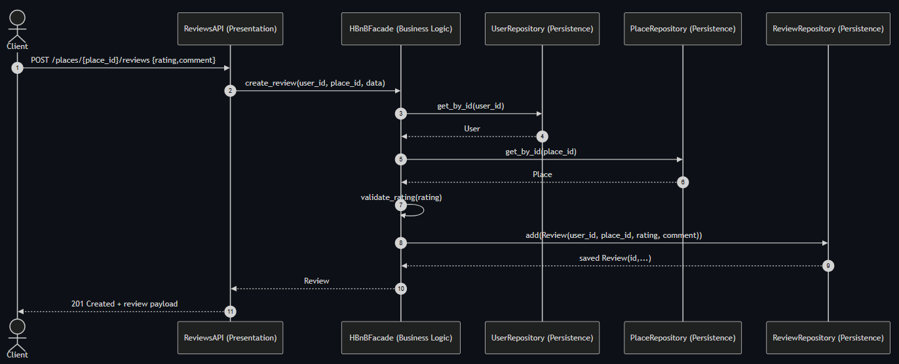
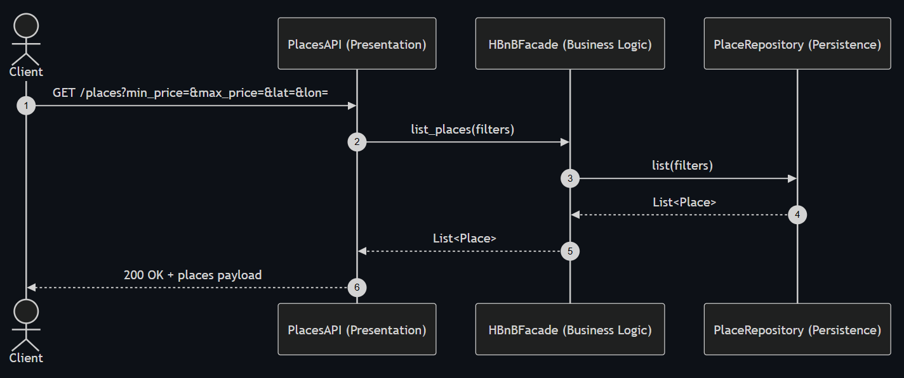

# HBnB Evolution — Part 1 Technical Documentation

## 0) High-Level Package Diagram (Architecture)

**Explanation**
- **Presentation Layer**: API/controllers handle requests/responses and call the facade.
- **Business Logic Layer**: entities + rules; exposes use cases through the facade.
- **Persistence Layer**: repositories/database operations (DB details in Part 3).
- **Facade pattern**: single entry point between Presentation and Business Logic.

---

## 1) Detailed Class Diagram — Business Logic Layer

**Explanation**
- All entities include: `id (UUID4)`, `created_at`, `updated_at`.
- **User 1 → * Place** (a user can own many places).
- **Place 1 → * Review** (a place can have many reviews).
- **Place * ↔ * Amenity** (many-to-many association).

---

## 2) Sequence Diagrams (API Calls)

### 2.1 User Registration (POST /users)

**Flow (summary)**
1. Client sends registration data to API.
2. API calls facade `register_user`.
3. Facade validates and asks repository to save user.
4. API returns `201 Created`.

### 2.2 Place Creation (POST /places)

**Flow (summary)**
1. Client sends place data to API.
2. API calls facade `create_place`.
3. Facade validates owner + data, persists place.
4. API returns `201 Created`.

### 2.3 Review Submission (POST /places/{place_id}/reviews)

**Flow (summary)**
1. Client submits rating/comment.
2. API calls facade `create_review`.
3. Facade validates user/place + rating, persists review.
4. API returns `201 Created`.

### 2.4 Fetch Places List (GET /places)

**Flow (summary)**
1. Client requests places list (optional filters).
2. API calls facade `list_places`.
3. Facade asks repository for places.
4. API returns `200 OK` with list.